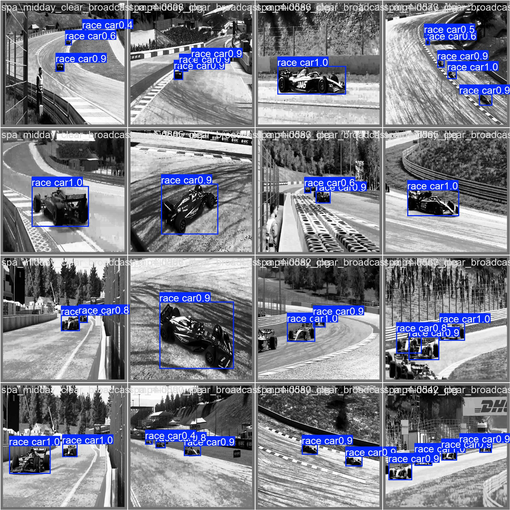
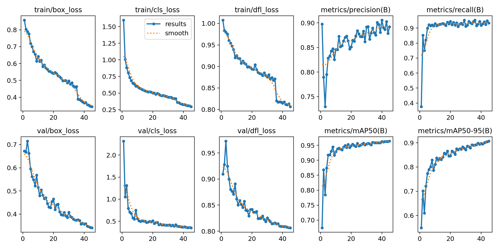
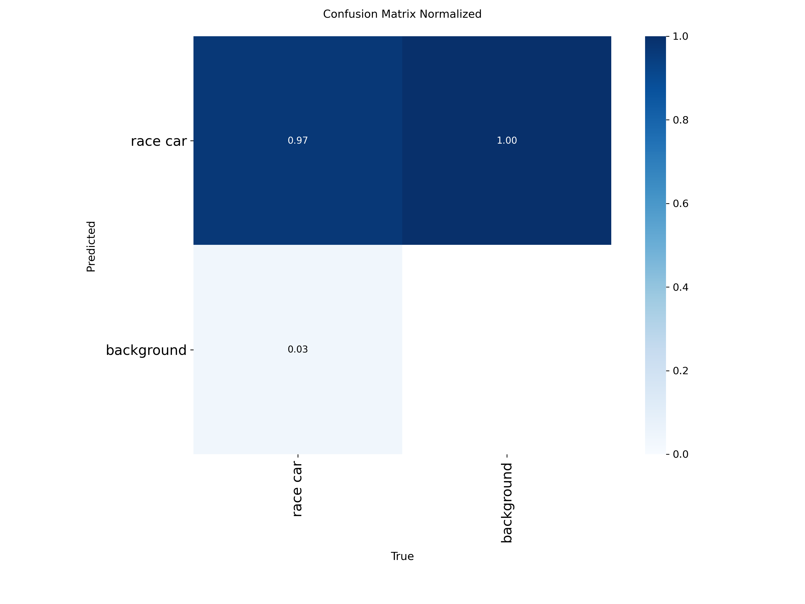

# F1 Detection and Telemetry Analysis

Detect F1 cars in broadcast footage, classify them by team livery, track them across frames, and estimate speed/position via homography — all from race video.



---

## What It Does

| Feature | Status | Description |
|---|---|---|
| Car Detection | Done — mAP50 0.964 | YOLOv8-based detection of F1 cars across broadcast frames, trained on ~2,100 greyscale images spanning multiple circuits and seasons |
| Team Classification | In progress — val_acc 77.6% | Identifies team by livery from detected car crops; works on training data but does not yet generalize reliably to unseen footage (full investigation below) |
| Multi-Object Tracking | Not started | Stub only — persistent IDs across frames |
| Speed & Position | Not started | Homography math written, untested against real footage |

---

## Architecture

```
                    ┌───────────────┐
                    │  Input Video   │
                    └───────┬───────┘
                            │
                            ▼
                  ┌───────────────────┐
                  │   YOLOv8 Detect    │   mAP50 0.964
                  │  (per-frame boxes) │
                  └─────────┬─────────┘
                            │  crop + greyscale
                            ▼
                  ┌───────────────────┐
                  │  Team Classifier    │   val_acc 77.6%
                  │  (livery → team)    │   ⚠ in progress
                  └─────────┬─────────┘
                            │
                            ▼
                  ┌───────────────────┐
                  │      Tracking        │   ⛔ not started
                  │  (persistent IDs)     │
                  └─────────┬─────────┘
                            │
                            ▼
                  ┌───────────────────┐
                  │     Homography        │   ⛔ not started
                  │  (pixel → real-world) │
                  └─────────┬─────────┘
                            │
                            ▼
                  ┌───────────────────┐
                  │ Annotated Output    │
                  │  (boxes + team +    │
                  │   speed/position)     │
                  └───────────────────┘
```

---

## Detection — done




- mAP50 **0.964**, mAP50-95 0.907, Precision 0.892, Recall 0.933
- Trained on the \`f1-car-dataset-kkvsm\` Roboflow dataset (single-class "race car")
- **Known limitation:** ~7% false-positive rate on fence mesh / crowd texture at lower confidence thresholds. Raising \`--conf\` to ~0.6 helps but doesn't fully eliminate it. Would need hard-negative training data to fix properly.

---

## Classification — an open problem, documented rather than hidden

Identifying team livery from a real broadcast crop turned out to be a much harder domain-shift problem than the clean validation numbers below suggest. Here's the investigation, step by step, so it isn't re-solved from scratch later:

1. **4-team color classifier** — 97.8% val accuracy, collapsed to one class on real crops. Cause: pipeline crops are greyscale, training data was color.
2. **Same data, greyscale** — confidence became honest, but still skewed toward 2 of 4 classes. Cause: no class existed for the other ~6 teams present in real footage.
3. **Expanded to 9 teams** with a second, thinner dataset — val accuracy 86%, but real-footage predictions collapsed onto the new, data-poor classes with suspiciously high confidence. Likely cause: the model picked up dataset-source artifacts rather than livery features.
4. **Hand-labeled real-domain data** — built a crop-to-source-frame color lookup so livery could be verified visually, then hand-labeled ~1,130 real crops into 10 balanced classes (64-144 images/class).
5. **Trained fresh on this data** — val_acc 77.6%.
6. **Tested on genuinely unseen footage** — still collapsed (~83% one class). Cause: a bug in crop extraction meant test crops were color while the model only knew greyscale.
7. **Fixed the bug, retested** — found ~7-8% of "car" crops were actually false-positive fence/crowd detections contaminating the test set.
8. **Retested on cleaned crops** — best result yet: predictions spread across all 10 classes, believable confidence (0.54-0.77) — but manual inspection showed most were still wrong; only a few classes had genuinely correct matches.
9. **Tested era-matched footage** to rule out training-era vs. test-era livery mismatch — no improvement, ruling this out.

**Current diagnosis:** most likely insufficient data per class (64-144 images), possibly compounded by some crops lacking enough visual detail to classify even in principle. Next step: scale hand-labeling 3-5x using the same proven workflow.

---

## Quick Start

### 1. Clone & install

\`\`\`bash
git clone https://github.com/<you>/F1_Detection_and_Telemetry_Analysis.git
cd F1_Detection_and_Telemetry_Analysis
python -m venv venv
venv\\Scripts\\activate       # Windows
pip install -r requirements.txt
\`\`\`

torch/torchvision are intentionally excluded from \`requirements.txt\` — installing them normally pulls the CPU-only build and silently overwrites any CUDA build. Install separately:

\`\`\`bash
pip install torch torchvision --index-url https://download.pytorch.org/whl/cu121
\`\`\`

### 2. Get the weights

Trained weights aren't committed to the repo. Download from [Releases](../../releases) and place under \`models/checkpoints/\`.

### 3. Run detection

\`\`\`bash
python src/detection/infer_yolo.py --source path/to/video.mp4
\`\`\`

Classification/tracking/telemetry stages are still under development — see Status table above.

---

## Requirements

\`\`\`
Python 3.x
ultralytics
torch / torchvision (installed separately, see above)
opencv-python
numpy
pandas
scikit-learn
\`\`\`

Install core deps: \`pip install -r requirements.txt\`

---

## Project Structure

\`\`\`
F1_Detection_and_Telemetry_Analysis/
├── src/
│   ├── detection/         # YOLOv8 training + inference
│   ├── classification/    # Team classifier: train, infer, fine-tune
│   ├── tracking/          # Multi-object tracking (stub)
│   └── telemetry/         # Homography, speed, position (stub, untested)
├── scripts/               # Dataset prep, crop extraction, labeling, evaluation
├── configs/                # Per-stage YAML configs
├── models/checkpoints/      # Trained weights (see Releases, not committed)
├── data/                    # Raw/interim/processed (not committed)
└── docs/images/               # Result visuals
\`\`\`

---

## Tips

- **Confidence threshold** — raise \`--conf\` on detection to reduce fence/crowd false positives, at some cost to recall.
- **GPU acceleration** — training and inference use CUDA automatically if PyTorch detects a GPU. See the setup note above for the correct install command.
- **Classifier config** — \`configs/classifier_config.yaml\` currently points at the 10-team hand-labeled dataset described above.

---

## Concepts Covered

- Object detection with YOLOv8
- Domain-shift debugging (color/greyscale mismatch, class imbalance, dataset contamination, era mismatch)
- Hand-labeling workflow via cross-source color lookup
- Homographic perspective transformation (in progress)
- Real-world metric estimation from video (in progress)

---

## Next Steps

- Scale hand-labeled classification data to several hundred images per class
- Implement tracking (\`src/tracking/tracker.py\`) — ByteTrack or custom IoU/Kalman
- Address detector false positives with hard-negative training data
- Wire up \`src/pipeline.py\` once classification is reliable enough to be useful downstream
